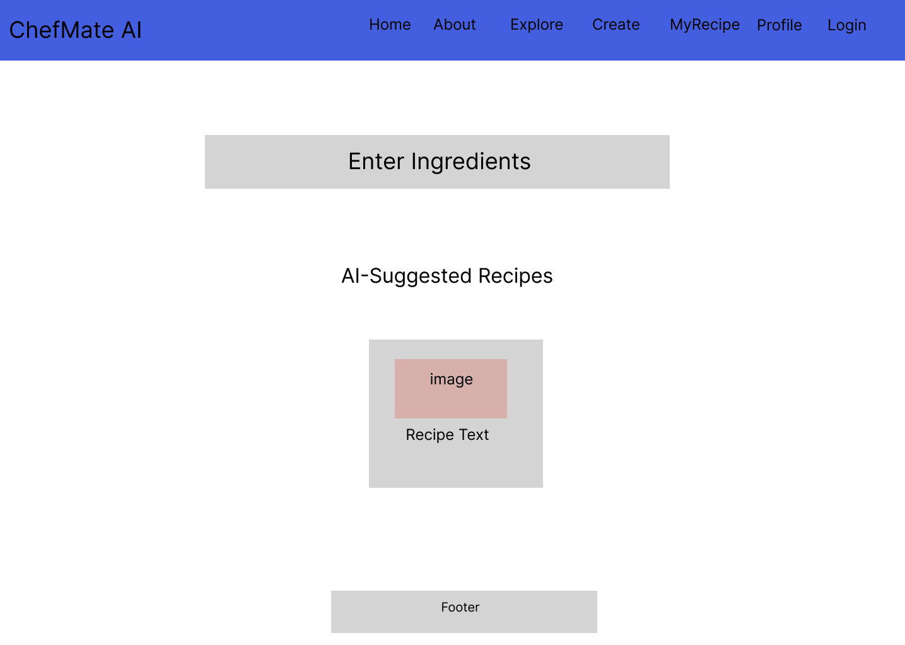
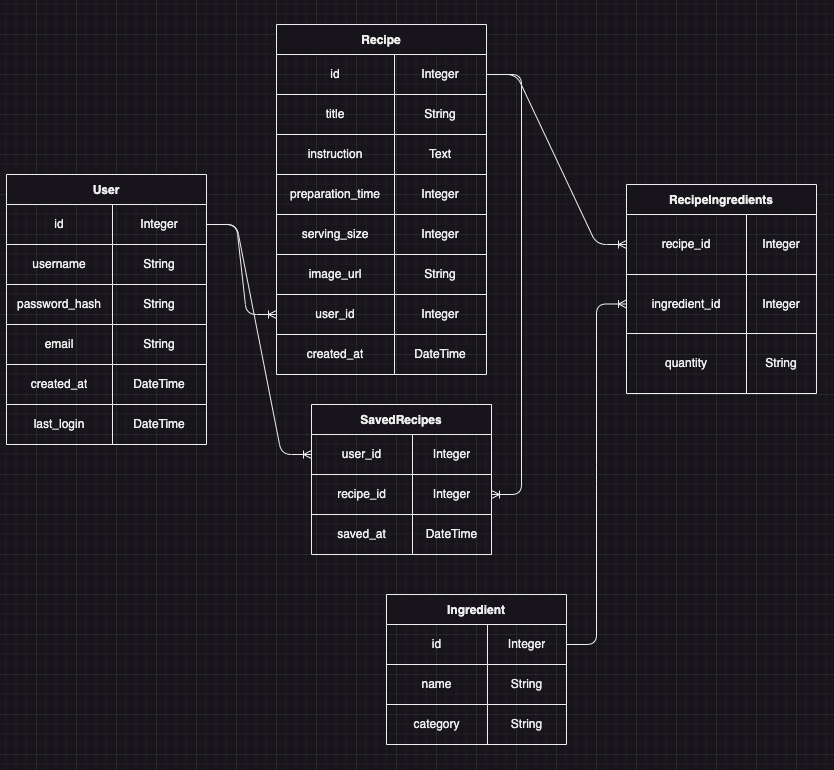

# ChefMate AI

<!-- Headings -->

## Description

ChefMate AI transforms your kitchen experience by suggesting delicious recipes tailored to your available ingredients and organizing your culinary favorites, all powered by advanced AI.

## Wireframe

### Home Page

### Restaurant Detail Page

### Reservations Page

## User Stories

1. Users

## React Components Tree

## Database Schema

## Constraints

- All users should have an unique usernames

## Validations

-

## API Routes

## Example of a Response Structure

GET /

## React Routes

## Stretch Goals

1. Users can

## Trello Board

