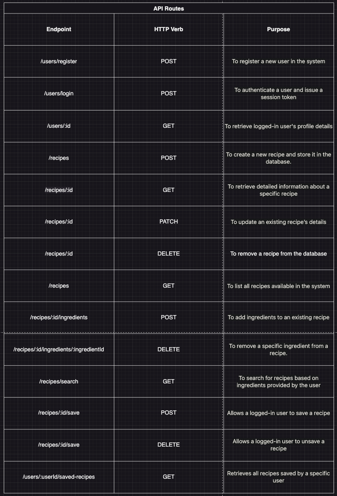
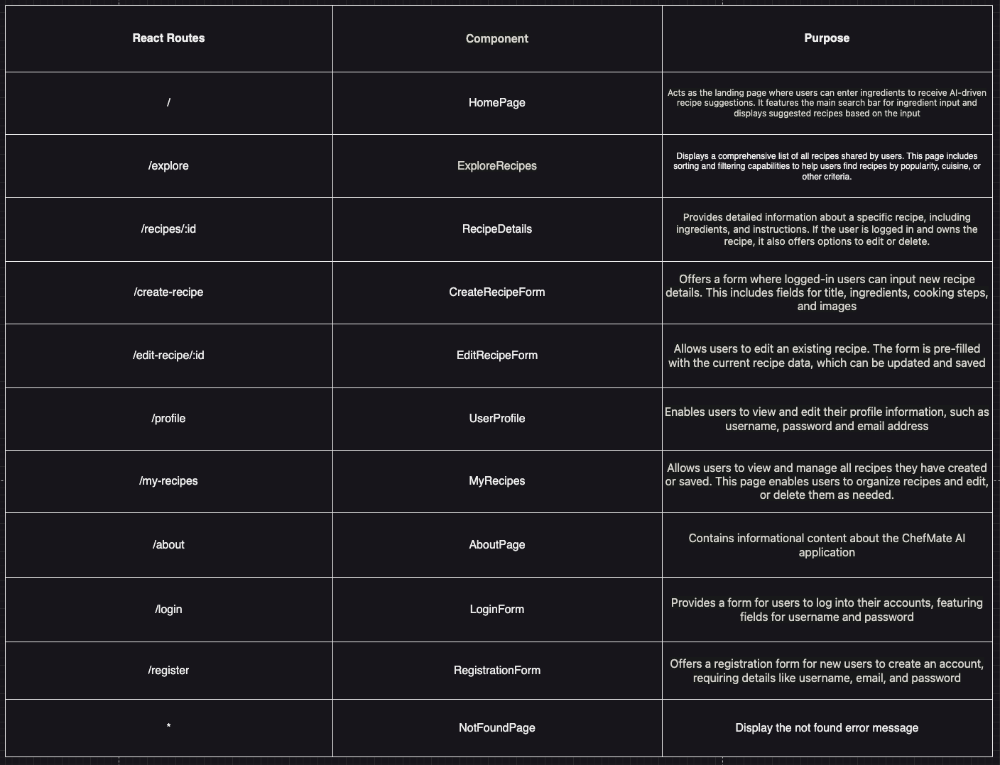

# ChefMate AI

<!-- Headings -->

## Description

ChefMate AI simplifies culinary creativity, offering a dynamic platform where users can discover recipes shared by a vibrant community, find new dishes based on available ingredients with AI-powered suggestions, and manage their culinary collections.

## Wireframe

### Home Page

### Explore Recipe Page

### Create Recipe Page

### My Recipe Page

### Recipe Details Page

## User Stories

1. Users can enter ingredients they have at home into a search bar prominently featured on the homepage. The AI-driven system quickly analyzes these inputs and suggests a recipe that utilize these ingredients.
2. Users can view the AI-suggested recipe directly on the homepage, making it easy to see the recipe based on what they already have.
3. There is a dedicated page accessible from the main navigation labeled "Explore Recipes." On this page, users can browse through a comprehensive list of recipes shared by all users within the ChefMate AI community.
4. From the comprehensive recipe list on the Explore Recipes page, users can click on any recipe to view its detailed information. This action redirects them to the Recipe Details page, where they can see ingredients, cooking instructions, preparation time, and serving size.
5. Logged-in users can save recipes to their favorites on the recipe details page. For recipes they have created, they also have options to edit or delete them.
6. Users who are logged in can create a new recipe by navigating to a "Create Recipe" form, accessible from their user dashboard or via a direct link in the main navigation. Additionally, users can edit their existing recipes by selecting the "Edit" option on the Recipe Details page.
7. In the "My Recipes" page, accessible from the main navigation, users can view and manage all recipes they have created or saved. This page allows them to organize recipes into collections, edit, or delete them as needed.
8. Users can access their profile to update personal details such as, username, password and email address.
9. The "About" page is available to all users who want to learn more about the ChefMate AI application.

## React Components Tree Diagram

## Database Schema

## Constraints

- Prevent the submission of empty fields in critical areas such as ingredient lists and cooking instructions
- Limit the length of the search input to prevent overload of the system
- Use foreign keys with on-delete and on-update cascades appropriately to maintain referential integrity between tables such as users, recipes, and ingredients
- Ensure that primary keys (e.g., user ID, recipe ID, ingredient ID) are unique and automatically generated by the system
- Users can only edit or delete their own recipes

## Validations

- Check for valid email format and unique username
- The username and password of the user must be non-empty
- Verify user permissions for any CRUD operation on sensitive data like editing or deleting a recipe
- Ensure that ingredient names and recipe titles do not contain invalid characters and meet specified length requirements

## API Routes

## Example of a Response Structure

### GET /recipes

## React Routes

## Stretch Goals

1. On the Explore Recipes Page, users browse through the recipes using various filters, such as cuisine, popularity, or recent additions.
2. Users can share their favorite recipes or their own creations directly from the application to social media platforms. The system provides easy-to-use sharing buttons on each recipe page, facilitating a broader community interaction and enabling users to discuss their culinary experiences.
3. Integrate a smart cooking timer that users can activate directly from the recipe details page. The timer can be set automatically based on the cooking times provided in the recipe or adjusted manually by the user.
4. Users can leave comments and ratings on Recipe Detail Page.

## Trello Board

